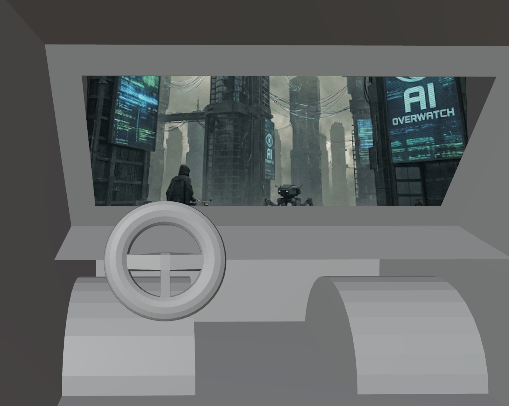
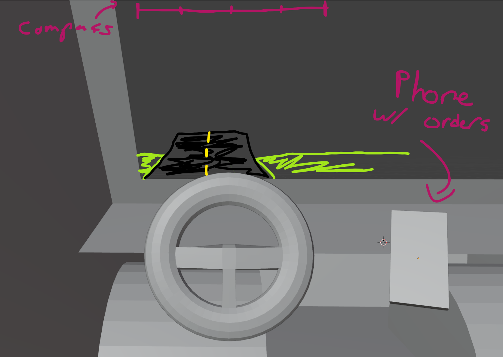

# Snowed In Studios Game Jam 2026

**Theme:** *AI Dystopia*

**Concept:** gig economy satire game, try to complete delivery orders as quickly as possible. spend money on upgrades to improve how many orders you can take. order volume and time requirements constantly become stricter, so other upgrades to improve the vehicle are also available.

**Scope goal:** to build the systems for driving the car, creating the orders and driving to the points to collect and deliver the order. *some upgrades*, and a "lose condition" where you fall below the constantly rising *cost of living* for a fixed amount of time.

## TODO

- [ ] improve car controls
  - [ ] car should stop / lose speed when hitting obstacles
  - [ ] car should move considerably slower when not on roads
  - [ ] car turning doesn't feel satisfying
- [ ] improve car visuals
  - [ ] car wheels should turn, camera turning should also feel better
- [ ] interior view improvements
  - [ ] wheel should turn
  - [ ] drivers side door should have window lol

