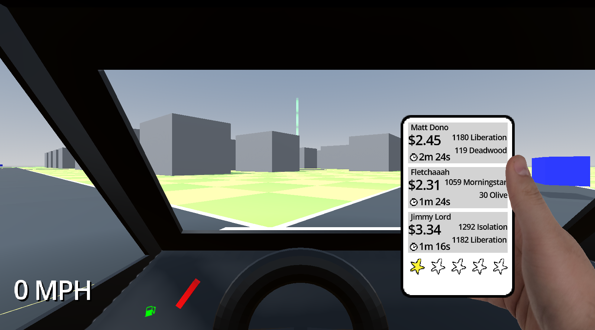
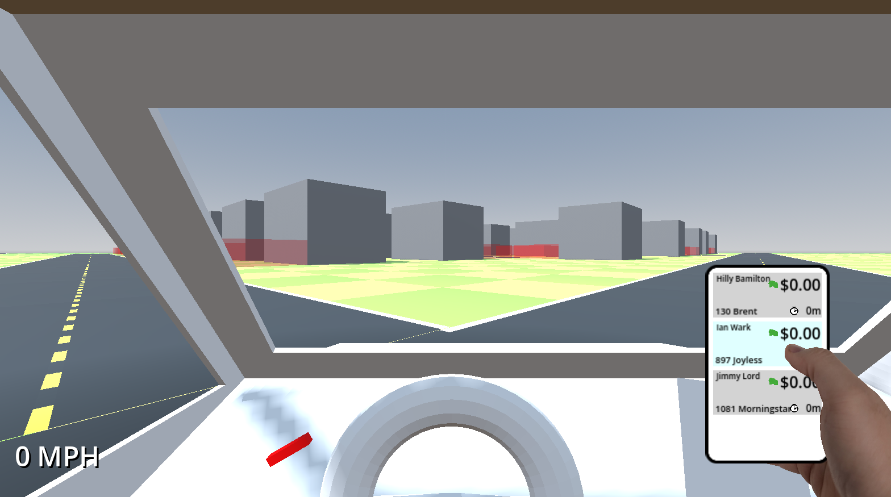

# Snowed In Studios Game Jam 2026

**Theme:** *AI Dystopia*

**Concept:** gig economy satire game, try to complete delivery orders as quickly as possible. spend money on upgrades to improve how many orders you can take. order volume and time requirements constantly become stricter, so other upgrades to improve the vehicle are also available.

**Scope goal:** to build the systems for driving the car, creating the orders and driving to the points to collect and deliver the order. *some upgrades*, and a "lose condition" where you fall below the constantly rising *cost of living* for a fixed amount of time.

## TODO

ordered in descending priority

- [x] core loop
  - [x] order flow
    - [x] choose active order from order view
    - [x] drive to pickup spot
    - [x] drive to destination spot
    - [x] earn money from completing orders
  - [x] gas up
    - [x] filling up with gas costs money
    - [x] gassing up needs feedback
  - [x] penalties
    - [x] failing an order reduces rating on app, leads to lower $$ earned
    - [x] missing feedback for failing orders!
- [x] minimap
    - [ ] needs arrow or some indicator of which direction to head

- [x] traffic
    - [x] cars have collision
    - [x] more traffic

- [x] improve car controls
  - [x] move slower on grass
  - [x] remove max speed clamp
  - [x] car can reverse
  - [x] car should stop / lose speed when hitting obstacles
  - [x] better braking
  - [x] car should move considerably slower when not on roads
  - [x] car turning doesn't feel satisfying

- [ ] improve car visuals
  - [ ] basic texturing
  - [x] steering wheel turns
- [x] bank app (shows goal and current balance)
- [ ] easy graphical wins
  - [ ] improve shadow res / jaggys
  - [ ] minor adjustments to car mesh

## Stretch Ideas (post-jam)

- [ ] upgrades
- [ ] two handed phone mode
- [ ] multiple phones
- [ ] drawbridges, tunnels, and highways
